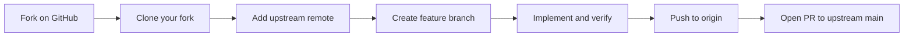

# Contributing to CDC Marketplace Frontend

Thank you for your interest in contributing. This project is open source under the [MIT License](LICENSE) and maintained by the [Congo Developers Club](https://github.com/congodevelopersclub).

- **Repository:** [congodevelopersclub/cdtm-front](https://github.com/congodevelopersclub/cdtm-front)
- **Issues:** [GitHub Issues](https://github.com/congodevelopersclub/cdtm-front/issues)
- **Pull requests:** [GitHub Pull Requests](https://github.com/congodevelopersclub/cdtm-front/pulls)

## Ways to contribute

Most contributors use a **fork**. Congo Developers Club members with write access may use a **direct branch** instead. Both paths require the same verification and architecture rules.

### Path A — Fork workflow (recommended)

For external contributors and anyone without direct write access to the upstream repo:

1. **Fork on GitHub** — click **Fork** on [congodevelopersclub/cdtm-front](https://github.com/congodevelopersclub/cdtm-front)
2. **Clone your fork** (replace `YOUR_USERNAME`):

   ```bash
   git clone git@github.com:YOUR_USERNAME/cdtm-front.git
   cd cdtm-front
   ```

3. **Add the upstream remote** (to sync with the main repo later):

   ```bash
   git remote add upstream git@github.com:congodevelopersclub/cdtm-front.git
   git remote -v
   ```

4. **Create a branch** from the latest `main`:

   ```bash
   git fetch upstream
   git checkout main
   git merge upstream/main
   git checkout -b feat/my-feature
   ```

5. **Develop** — run `pnpm install`, make your changes, and run verification (see below)
6. **Push to your fork**:

   ```bash
   git push origin feat/my-feature
   ```

7. **Open a pull request** on GitHub from `YOUR_USERNAME/cdtm-front:feat/my-feature` → `congodevelopersclub/cdtm-front:main`

**Keep your fork in sync** before starting new work or updating an open PR:

```bash
git fetch upstream
git checkout main
git merge upstream/main
git push origin main
```



### Path B — Direct branch (alternative)

For Congo Developers Club members with **write access** to the upstream repository:

1. Clone upstream directly:

   ```bash
   git clone git@github.com:congodevelopersclub/cdtm-front.git
   cd cdtm-front
   ```

2. Create a branch: `git checkout -b feat/my-feature`
3. Push to upstream: `git push origin feat/my-feature`
4. Open a pull request against `main` on the same repository

## Development setup

### Prerequisites

- Node.js >= 20
- pnpm 10.x

### Install and run

Clone using the URL that matches your contribution path (see [Ways to contribute](#ways-to-contribute)):

**Fork (recommended):**

```bash
git clone git@github.com:YOUR_USERNAME/cdtm-front.git
cd cdtm-front
```

**Direct branch (alternative):**

```bash
git clone git@github.com:congodevelopersclub/cdtm-front.git
cd cdtm-front
```

Then install dependencies and start the dev servers:

```bash
pnpm install
pnpm dev
```

| App | URL |
|-----|-----|
| Web (marketing) | http://localhost:3000 |
| Marketplace | http://localhost:3001 |

### Environment variables

Create `.env.local` inside the app you are working on. Never commit secrets or `.env` files.

```env
# apps/web/.env.local
NEXT_PUBLIC_API_URL=http://localhost:8000/api
NEXT_PUBLIC_APP_URL=http://localhost:3000
```

```env
# apps/marketplace/.env.local
NEXT_PUBLIC_API_URL=http://localhost:8000/api
NEXT_PUBLIC_APP_URL=http://localhost:3001
```

## Development workflow

Follow [Path A (fork)](#path-a--fork-workflow-recommended) or [Path B (direct branch)](#path-b--direct-branch-alternative) above, then apply the conventions below before opening your pull request.

### Branch naming

Use descriptive prefixes:

- `feat/` — new features
- `fix/` — bug fixes
- `docs/` — documentation only
- `refactor/` — code changes without behavior change

Examples: `feat/newsletter-signup`, `fix/login-redirect`, `docs/contributing-guide`

### Commit messages

Write clear, imperative commit messages:

```
Add newsletter signup form to home page

Fix JWT redirect loop on marketplace login

Update contributing guide with FSD rules
```

### Verification (required before every PR)

All commands must pass with **zero errors**:

```bash
pnpm lint
pnpm typecheck
pnpm build
```

Optionally format code:

```bash
pnpm format
```

## Pull request checklist

Before requesting review, confirm:

- [ ] `pnpm lint`, `pnpm typecheck`, and `pnpm build` all pass
- [ ] Changes follow Feature-Sliced Design architecture
- [ ] New slices export through `index.ts` (public API)
- [ ] No cross-slice imports (e.g. one feature importing another)
- [ ] No Axios or HTTP client imports in `components/` or `hooks/`
- [ ] No Zustand usage outside `src/shared/store/`
- [ ] PR has a descriptive title and summary of what changed and why

## Architecture rules

This monorepo uses **Feature-Sliced Design (FSD)**. Read these rules before adding or moving code.

### Monorepo layout

| Path | Purpose |
|------|---------|
| `apps/web` | Marketing / public site |
| `apps/marketplace` | Authenticated product app |
| `packages/ui` | shadcn/ui design system |
| `packages/api` | Axios client factory, interceptors, error types |
| `packages/i18n` | Locale config and cookie / Accept-Language resolution |
| `apps/storybook` | Component workshop (Storybook) |
| `packages/eslint-config` | Shared ESLint configs including FSD boundary rules |
| `packages/typescript-config` | Shared TypeScript configs |

Business logic (entities, features, widgets, views) stays **per-app** in each app's `src/`. Do not create shared business packages unless a slice is genuinely reused by both apps.

### FSD layers

Each app follows this structure under `src/`:

```text
src/
├── processes/   # Multi-page workflows (marketplace only)
├── views/       # Page compositions (import as @/pages/*)
├── widgets/     # Large reusable UI compositions
├── features/    # Business capabilities / user actions
├── entities/    # Business objects
└── shared/      # Reusable infrastructure (no business logic)
```

**Important:** Next.js treats any `pages/` directory as the Pages Router. Page compositions live in `src/views/` and are imported via the `@/pages/*` alias.

Next.js routes in `app/` must be **thin delegates only**:

```tsx
// app/dashboard/page.tsx
export { DashboardPage as default } from "@/pages/dashboard"
```

### Dependency rule

Dependencies always point **downward**. Never import from an upper layer.

```text
processes → pages → widgets → features → entities → shared
```

Forbidden examples:

- `shared` importing from `features`
- `entities` importing from `widgets`
- `features` importing from `pages`

ESLint enforces layer direction via `@workspace/eslint-config/fsd-lint`.

### Cross-slice isolation

Slices in the same layer cannot import each other:

- `features/login` cannot import `features/create-listing`
- `entities/user` cannot import `entities/product`
- `widgets/sidebar` cannot import `widgets/navbar`

Share code through lower layers (`entities/`, `shared/`) instead.

### Public API

Always import slices through their `index.ts` barrel:

```ts
// Correct
import { LoginForm } from "@/features/login"

// Blocked by ESLint
import { LoginForm } from "@/features/login/components/login-form"
```

Every new slice must export its public surface through `index.ts`.

### Import order

Imports are ordered: external packages, then FSD layers (features → entities → shared).

Within the same slice, relative imports are allowed (e.g. `../api/login.api`).

### State management

| Tool | Use for | Never use for |
|------|---------|---------------|
| TanStack Query | Server state (API data, mutations, cache) | UI-only state |
| Zustand | UI state in `src/shared/store/` (sidebar, modals, table prefs) | API responses, auth data, server lists |

### API layer

- HTTP is abstracted in `@workspace/api`
- Each app creates a client in `src/shared/axios/client.ts`
- Endpoint modules live in `src/shared/api/` or in entity/feature `api/` folders
- **Never** import Axios directly in components or hooks

### Architecture bans (ESLint enforced)

- Axios / HTTP client — only in `api/` modules
- Zustand — only in `src/shared/store/`

## Internationalization

Both apps support **English (`en`)** and **French (`fr`)** via [next-intl](https://next-intl.dev/). There is **no locale prefix in URLs** — routes stay `/`, `/login`, `/dashboard`, etc.

### Locale resolution

1. `NEXT_LOCALE` cookie (set by the language switcher)
2. `Accept-Language` request header (browser / device language)
3. Fallback: `en`

Shared locale logic lives in `packages/i18n` (`@workspace/i18n`). Per-app message files live in `src/shared/i18n/messages/{locale}.json`.

### Adding translations

- **Client components:** `useTranslations("Namespace")`
- **Server components / actions:** `getTranslations("Namespace")`
- Never hardcode user-facing strings in components
- Add keys to **both** `en.json` and `fr.json`
- For Zod validation, use schema factories that accept a translate function (see `features/login/validation.ts`)

### Language switcher

The locale switcher widget sets the `NEXT_LOCALE` cookie via a Server Action (`src/shared/i18n/actions/set-locale.ts`) and refreshes the page.

## Storybook

The monorepo includes a centralized component workshop at [`apps/storybook/`](apps/storybook/) powered by [Storybook 10](https://storybook.js.org/docs).

```bash
pnpm storybook          # http://localhost:6006
pnpm build-storybook    # static export → apps/storybook/storybook-static/
```

### Catalog structure

| Sidebar prefix | Source |
|----------------|--------|
| `Design System/` | [`packages/ui/src/components/`](packages/ui/src/components/) |
| `Web/` | [`apps/web/src/`](apps/web/src/) widgets, features, pages |
| `Marketplace/` | [`apps/marketplace/src/`](apps/marketplace/src/) widgets, features, pages |

### Conventions

- Co-locate stories as `<component>.stories.tsx` next to the component
- Use CSF3 with `tags: ['autodocs']` for generated docs
- Use title prefixes above for sidebar grouping
- New shadcn component → add a story before merging
- New widget, feature, or page → add at least one default story and key state variants
- Use shared decorators in `apps/storybook/.storybook/decorators/` — do not duplicate provider wiring in every story
- Set `parameters.i18n.app` (`web` \| `marketplace`) and locale on app stories

## Adding a new feature

1. **Pick the layer** — Is it a user action (feature), business object (entity), composite UI (widget), or page composition (view)?
2. **Create the slice** — kebab-case folder with `index.ts` public API
3. **Add internals** — `api/`, `hooks/`, `components/`, `validation.ts` as needed
4. **Compose upward** — wire into widget or view; add a thin route in `app/`
5. **Verify** — run `pnpm lint`, `pnpm typecheck`, `pnpm build`

### Reference slices

Copy these patterns when adding new functionality:

| App | Slice | Pattern |
|-----|-------|---------|
| Web | `apps/web/src/features/newsletter-signup` | Server Action + Zod + toast |
| Marketplace | `apps/marketplace/src/features/login` | TanStack mutation + JWT + middleware |

### Feature folder example

```text
features/create-listing/
├── api/create-listing.api.ts
├── components/create-listing-form.tsx
├── hooks/use-create-listing.ts
├── validation.ts
└── index.ts
```

## Adding shadcn components

Install into the shared UI package:

```bash
pnpm dlx shadcn@latest add <component> -c apps/web
```

Components are placed in `packages/ui/src/components/`. Import them in apps:

```tsx
import { Button } from "@workspace/ui/components/button"
```

## Code style

- **TypeScript** — strict mode; prefer `type` over `interface`
- **Imports** — use `import type` for type-only imports
- **Formatting** — Prettier via `pnpm format`
- **Linting** — ESLint enforces FSD boundaries; all violations are errors
- **Naming** — kebab-case folders, PascalCase components, camelCase hooks with `use` prefix
- **Comments** — only for non-obvious business logic; code should be self-documenting

## Decision checklist

Before creating a file, folder, hook, or component, ask:

1. Does this belong in `packages/` (shared infra) or app `src/shared/`?
2. Is it a business object → `entities/{name}/`?
3. Is it a user action → `features/{action-name}/`?
4. Is it composite UI → `widgets/{name}/`?
5. Is it page composition → `views/{name}/` (exported as `@/pages/{name}`)?
6. Is it a multi-page flow → `processes/{name}/` (marketplace only)?
7. Is it a Next.js route → `app/` one-liner delegate only?

Choose the simplest architecture that remains scalable.

## Getting help

- Open a [GitHub issue](https://github.com/congodevelopersclub/cdtm-front/issues) for bugs, questions, or feature proposals
- Reference the relevant app, route, or slice in your issue description
- Tag maintainers on pull requests when ready for review

Thank you for contributing.
